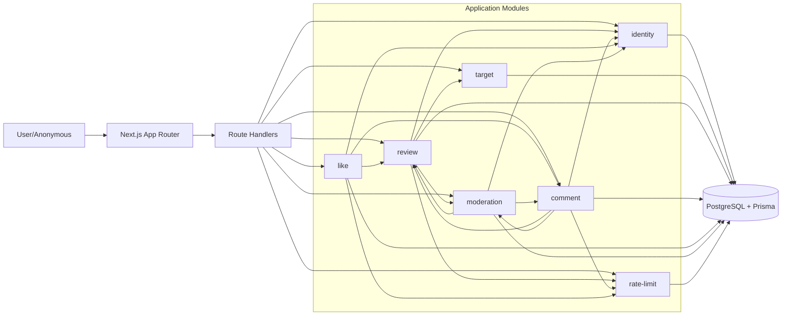

# LogWood

AI 编码工具评测社区，聚焦 AI Editor 与 AI Coding 助手的真实使用反馈与能力对比。

## Overview

LogWood 的目标是构建一个高质量、可持续迭代的评测平台：
- 用户可以围绕具体工具和能力标签发布评测、点赞、评论与举报。
- 平台在开放匿名参与的同时，通过限流、风控、审核机制控制噪音与刷量。
- 架构上采用“可演进的模块化单体”，优先保证一致性、稳定性和迭代效率。

当前规划基于 [SPEC.md](./SPEC.md)，并按 Phase 1 -> Phase 3 分阶段落地。

## Core Features

- 工具目录与详情：`/editor`、`/coding`、`/:type/[slug]`
- 评测闭环：发布、列表、详情、排序（latest/hot）
- 互动能力：点赞（幂等）、评论、举报
- 身份体系：匿名用户 + 登录用户（Email Magic Link + 可选 GitHub OAuth）
- 治理机制：限流、敏感词、风险转 `pending`、举报折叠
- 多语言内容：界面中文，内容支持多语言输入与检索

## Tech Stack

- Frontend: Next.js 14 (App Router) + TypeScript + Tailwind CSS
- Backend: Next.js Route Handlers + Service Layer
- Database: PostgreSQL + Prisma ORM
- Auth: NextAuth.js
- Deploy: Vercel

## Architecture (Modular Monolith)

推荐使用模块化单体而不是过早微服务化，每个模块内部高内聚、模块间低耦合。



建议模块边界：
- `target`: 工具目录、工具详情、标签管理
- `review`: 评测发布、查询、排序、状态流转
- `like`: 点赞幂等、计数维护
- `comment`: 评论发布、查询、状态流转
- `moderation`: 敏感词、举报、折叠、审核
- `identity`: 登录用户与匿名用户身份识别
- `rate-limit`: 用户/设备/IP 维度限流与审计

## API Scope (Phase 1)

- `POST /api/reviews`
- `GET /api/reviews`
- `POST /api/reviews/:id/like`
- `POST /api/comments`
- `POST /api/reports`

详细字段与行为约束见 [SPEC.md](./SPEC.md)。

## Project Structure (Recommended)

> 以下为建议目录，用于后续代码落地时保持一致性。

```text
src/
  app/                    # Next.js routes/pages
  modules/
    review/
      domain/             # entities, value objects, domain services
      application/        # use cases
      infra/              # prisma repository, mapper
      api/                # route handler adapters, dto schemas
      tests/              # module contract + integration tests
    like/
    comment/
    moderation/
    target/
    identity/
    rate-limit/
  shared/
    kernel/               # shared types/errors/result abstractions
    config/               # env and runtime config
    observability/        # logs, metrics, tracing
```

## How To Keep Modules Decoupled and Stable

你提出的方向是正确的：通过模块解耦 + 独立规范 + 独立测试，可以在不重构全局的情况下迭代小模块。  
工程上建议采用以下成熟组合，而不是只靠“约定”：

1. 固定模块契约（Contract First）
- 每个模块必须维护 `module-spec.md`（输入、输出、错误码、状态机、边界条件）。
- 对外只暴露 application 层接口与 DTO，不允许跨模块直接访问对方数据库表。

2. 统一分层与依赖规则
- 强制依赖方向：`api -> application -> domain -> infra`。
- 模块之间只能通过 `application contract` 交互，禁止跨模块调用 `infra` 实现。

3. 契约测试 + 集成测试双轨
- 契约测试：验证模块公开接口语义稳定。
- 集成测试：验证跨模块协作链路（如评测发布 -> 风控 -> 状态流转）。
- E2E 测试：覆盖核心用户闭环。

4. 版本化与兼容策略
- API 变更采用版本号或兼容字段扩展策略。
- 非兼容改动必须先发 ADR（Architecture Decision Record）并附迁移方案。

5. 质量门禁（CI）
- PR 必须通过：lint、type-check、unit、contract、integration。
- 关键模块设置最小覆盖率阈值与变更影响检查。

6. 可观测与回滚
- 每个模块定义核心指标（成功率、延迟、错误分布、风控命中率）。
- 通过 feature flag 灰度上线，支持快速回滚。

## Module Standard Template (Recommended)

每个模块建议固定以下文档与测试资产：
- `modules/<name>/module-spec.md`
- `modules/<name>/CHANGELOG.md`
- `modules/<name>/tests/contract/*.test.ts`
- `modules/<name>/tests/integration/*.test.ts`

`module-spec.md` 最小字段建议：
- 目标与边界（In Scope / Out of Scope）
- 领域模型与状态机
- 输入输出 DTO
- 错误码与异常语义
- 幂等与并发规则
- 风控与限流规则
- 观测指标
- 兼容性与迁移要求

## Module Specs (Concrete)

基于当前 `SPEC.md` 的模块实规与测试清单已落地到：
- `docs/modules/README.md`
- `docs/modules/<module>/module-spec.md`
- `docs/modules/<module>/test-cases.md`

## Roadmap

- Phase 1 (4-6 weeks): 评测闭环 MVP（发布、浏览、互动、举报、基础风控）
- Phase 2 (2-3 weeks): 审核台、反刷增强、排序升级
- Phase 3 (2-4 weeks): 榜单 2.0、用户中心增强、定价模块扩展

## Contributing

当前仓库处于规划阶段，欢迎通过 Issue/PR 补充：
- 数据模型细化（Prisma Schema）
- API 契约与错误码规范
- 模块规范模板与测试模板
- 可观测与风控策略落地方案

## License

待定
