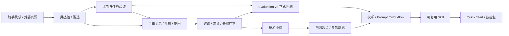

# 空心树洞（LogWood）

> **大浪淘沙，找寻灵感**

空心树洞是一套 **AI 灵感炼成与实践沉淀社区**：从一个念头、一条链接或一次踩坑出发，经过试用、评测与反复打磨，把值得留下的经验炼成可复用、可验证、可快速上手的模板、提示词、工作流和技能包；同时保存这段路上的吐槽、失败、讨论、技术小结与深度反思。

## 产品生命线

项目围绕同一个灵感、资源或 Skill 建立两条互相关联的轨道。


```mermaid
flowchart LR
  I[随手灵感 / 外部资源] --> C[灵感池 / 候选]
  C --> T[试用与任务验证]
  T --> E[Evaluation v2 正式评测]
  E --> R[模板 / Prompt / Workflow]
  R --> S[可复用 Skill]
  S --> P[Quick Start / 技能包]

  C --> Q[自由记录 / 吐槽 / 提问]
  T --> Q
  Q --> D[讨论 / 求证 / 失败样本]
  D --> E
  D --> N[技术小结]
  N --> A[前沿观点 / 复盘反思]
  A --> R
```

### 资产进化线

```text
灵感或资源
  → 待观察
  → 真实试用
  → 带版本、环境、证据和失败边界的正式评测
  → 可复用模板 / Prompt / Workflow
  → 带示例和 Quick Start 的技能包
  → 持续升级或归档
```

### 经验沉淀线

```text
即时吐槽 / 自由记录
  → 提问、讨论与求证
  → 实验记录与失败样本
  → Evaluation v2 / 技术小结
  → 前沿观点 / 项目复盘 / 自我反思
```

两条线共享同一个内容对象和来源链。成品不抹掉中间试错，沿途经验也能够反过来推动 Skill 继续改进。

完整产品定义见 [`docs/PRODUCT_POSITIONING.md`](./docs/PRODUCT_POSITIONING.md)。正式评测规范见 [`docs/EVALUATION_PROTOCOL_V2.md`](./docs/EVALUATION_PROTOCOL_V2.md)。整体升级计划见 [Issue #15](../../issues/15)。

## 产品结构

核心入口：

| 入口 | 路由 | 作用 |
|---|---|---|
| 找灵感 | `/candidates` | 收录模型、软件、服务、仓库、网站、知识资源和一句话灵感，并进入试用生命线 |
| Skill 库 | `/skills` | 陈列已具备复用价值的 Prompt、Template、Workflow、Agent Skill 和技能包 |
| 正式评测 | `/evaluations` | 查看基于版本、环境、任务、证据、复现级别、评分维度和失败边界的 Evaluation v2 |
| 吐槽室 | `/talk` | 承接自由记录、提问、求证、踩坑、发现和阶段性判断 |
| 洞笔记 | `/articles` | 沉淀技术小结、前沿观察、项目复盘和自我反思 |

辅助入口：

- 资源收藏：`/tools`
- 案例画廊：`/app`
- AI 炼成助手 Beta：`/forge`

AI 炼成助手当前只执行确定性的本地模板整理，不替代真实测试，也不生成或伪造证据。

## Review 与 Evaluation

项目同时保留两种内容层：

### Review：自由记录

- 第一感受
- 吐槽和踩坑
- 提问、求证和替代方案
- 阶段性使用经验
- 可匿名或登录参与

### Evaluation v2：正式评测

- 明确被测对象和版本
- 记录模型、软件、操作系统和硬件环境
- 保存测试任务、输入、执行过程和输出
- 支持外部证据、复现级别和重复次数
- 按 Skill、模型、软件/服务、普通资源使用不同评分协议
- 记录成功点、限制、失败边界和总体结论
- 草稿允许逐步补齐；发布态必须通过协议门禁

历史 Review 不会被静默转换成正式 Evaluation。首期 Evaluation 写入仅管理员开放，公开用户可以浏览已发布报告。

## 当前实现

- 灵感池：`/candidates` 和 `/candidates/manage`
- Skill 库：`/skills` 和 `/skills/manage`
- 正式评测：`/evaluations`、`/evaluations/[id]`、`/evaluations/manage`
- 吐槽室：`/talk`
- 历史资源：`/tools` 及 Editor / Coding / Model / Prompt 旧详情路由
- 案例和项目：`/app`
- 洞笔记：`/articles`
- 本地草稿整理：`/forge`
- Review：多态关联 Target、Skill、App 或 Candidate
- Evaluation：独立模型和协议版本，不修改历史 Review
- 社区互动：匿名或登录发布、评论、点赞、举报
- 内容治理：限流、敏感内容判定、自动隐藏和审核流
- 工程底座：模块化单体、PostgreSQL、Prisma、NextAuth、Docker Compose

## 核心原则

1. **同一对象持续生长**：状态变化不创建断裂的新对象。
2. **证据优于声量**：热度用于发现，证据决定可信度。
3. **自由记录与正式评测分层**：真实情绪可以低门槛记录，正式结论必须有上下文和证据。
4. **过程和结果同等重要**：失败、吐槽和判断变化必须可追溯。
5. **复用优于收藏**：内容最终应帮助用户快速开始或避免重复踩坑。
6. **兼容优于重写**：历史数据先挂接、再迁移，不为模型整洁牺牲内容资产。
7. **AI 辅助而不代替**：未经验证的内容不能被包装成事实。
8. **版本和时效可见**：模型、软件、Skill 和评测结论都可能过期。

## 文档索引

| 文档 | 责任 |
|---|---|
| [`docs/PRODUCT_POSITIONING.md`](./docs/PRODUCT_POSITIONING.md) | 产品定位、双线生命线、内容对象、迁移原则和衡量方式；产品定义 SSOT |
| [`docs/EVALUATION_PROTOCOL_V2.md`](./docs/EVALUATION_PROTOCOL_V2.md) | 正式评测协议、维度、字段、发布门禁和权限 |
| [`docs/PROJECT_PLAN.md`](./docs/PROJECT_PLAN.md) | 当前实现、架构边界、风险、近期变更和执行计划 |
| [`SPEC.md`](./SPEC.md) | 历史 Review MVP 规格；不再定义当前产品定位 |
| [`docs/SEO_STRATEGY.md`](./docs/SEO_STRATEGY.md) | SEO 长期策略和变更约束 |
| [`docs/SEO_CHANGELOG.md`](./docs/SEO_CHANGELOG.md) | 近期 SEO 增量决策 |
| [`docs/STYLE_GUIDE.md`](./docs/STYLE_GUIDE.md) | 视觉系统与组件样式规范 |
| [`docs/modules/`](./docs/modules/) | 各业务模块契约与测试清单 |

## 技术栈

- Frontend：Next.js 14 App Router、React 18、TypeScript、Tailwind CSS
- Backend：Next.js Route Handlers、Service Layer
- Database：PostgreSQL、Prisma ORM
- Auth：NextAuth.js（GitHub OAuth + 管理员凭证）
- Editor：Tiptap
- Test：Vitest
- Deploy：Docker Compose；保留 Vercel 运行能力

## 快速启动

### 1. 准备环境变量

```bash
cp .env.example .env
```

生产环境至少需要：

- `DATABASE_URL`
- `NEXTAUTH_URL`
- `NEXTAUTH_SECRET`

GitHub 登录和管理员变量见 `.env.example`。

### 2. 启动服务

```bash
docker compose up --build
```

本地热更新：

```bash
NODE_ENV=development docker compose up --build
```

### 3. Evaluation v2 schema 更新

本次新增 Evaluation 表和枚举。更新代码后至少执行：

```bash
docker compose exec web bunx prisma generate
docker compose exec web bunx prisma db push
```

正式生产数据库应先备份并审阅 schema diff；长期建议切换到版本化 Prisma migration。

### 4. 验证

```bash
docker compose exec web bun run test
docker compose exec web bunx tsc --noEmit
docker compose exec web bun run build
```

## 架构

主要模块位于 `src/modules/`：

- `skill`：Skill CRUD、分类、效果图和草稿状态
- `candidate`：灵感 / 候选和现有晋升流程
- `target`：历史模型、软件、工具和 Prompt 目录
- `review`：自由记录的多态发布、查询和统计
- `evaluation`：正式评测协议、发布门禁、查询和持久化
- `comment` / `like`：Review 互动
- `moderation` / `rate-limit`：治理、举报和行为限流
- `identity`：登录和匿名身份
- `article` / `article-column`：洞笔记和专栏
- `app`：案例、应用和项目
- `forge`：本地草稿整理
- `audit`：管理员状态变更审计

Route Handler 调用模块 service；跨模块通过公开契约协作，避免直接访问其他模块的 Prisma 模型。

## 数据兼容约束

- 不删除历史内容
- 不改变历史 Review ID
- 保留旧 slug 和可访问路径
- Candidate 进入下一阶段后，Review、Comment、Like 和 Evaluation 必须仍然可追溯
- 历史自由记录继续按旧 schema 展示
- Evaluation 使用独立表和版本化协议
- 新模型稳定后再通过 redirect、canonical 和迁移脚本收口
- 数据迁移支持 dry-run、统计核对、重复执行和回滚

## 测试策略

优先级：

1. Service 业务规则：校验、鉴权、限流、状态机、评测协议和数据迁移
2. API 集成测试：参数、错误码、鉴权和数据库写入
3. 少量核心 E2E：围绕完整用户生命线

Evaluation 变更至少覆盖：

- 对象与协议匹配
- 草稿允许部分字段
- 发布需要全部维度评分
- 输出或证据门禁
- 复现级别和重复次数
- 公开查询排除草稿与归档
- sitemap 只输出已发布详情

## 贡献方式

Issue #15 继续跟踪：

- Candidate 晋升后的历史连续性
- Resource / Skill 成熟度和版本模型
- Quick Take 持久化类型
- Skill 输入输出、依赖、Quick Start 和技能包
- 历史数据 dry-run 迁移
- 真实 AI 辅助评测和证据整理

功能、架构、数据库或迁移策略变化时，必须同步更新 `docs/PROJECT_PLAN.md`。

## License

待定。
