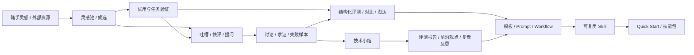

# 空心树洞（LogWood）

> **大浪淘沙，找寻灵感**

空心树洞是一套 **AI 灵感炼成与实践沉淀社区**：从一个念头、一条链接或一次踩坑出发，经过试用、评测与反复打磨，把值得留下的经验炼成可复用、可验证、可快速上手的模板、提示词、工作流和技能包；同时保存这段路上的吐槽、失败、讨论、技术小结与深度反思。

## 产品生命线

项目围绕同一个灵感、资源或 Skill 建立两条互相关联的轨道。


```mermaid
flowchart LR
  I[随手灵感 / 外部资源] --> C[灵感池 / 候选]
  C --> T[试用与任务验证]
  T --> E[结构化评测 / 对比 / 淘汰]
  E --> R[模板 / Prompt / Workflow]
  R --> S[可复用 Skill]
  S --> P[Quick Start / 技能包]

  C --> Q[吐槽 / 快评 / 提问]
  T --> Q
  Q --> D[讨论 / 求证 / 失败样本]
  D --> N[技术小结]
  N --> A[评测报告 / 前沿观点 / 复盘反思]

  D --> E
  A --> R
```

### 资产进化线

```text
灵感或资源
  → 待观察
  → 试用
  → 验证
  → 可复用模板 / Prompt / Workflow
  → 带版本、示例和 Quick Start 的技能包
  → 持续升级或归档
```

### 经验沉淀线

```text
即时吐槽 / 快评
  → 提问、讨论与求证
  → 实验记录与失败样本
  → 技术小结
  → 评测报告 / 前沿观点 / 复盘反思
```

两条线共享同一个内容对象和来源链。最终成品不抹掉中间的试错，沿途经验也能够反过来推动 Skill 继续改进。

完整产品定义见 [`docs/PRODUCT_POSITIONING.md`](./docs/PRODUCT_POSITIONING.md)。整体升级计划见 [Issue #15](../../issues/15)。

## 产品结构

目标信息架构收口为四个稳定入口：

| 入口 | 作用 |
|---|---|
| 找灵感 | 收录模型、软件、服务、仓库、网站、知识资源和一句话灵感，并进入试用与评测生命线 |
| Skill 库 | 陈列已经具备复用价值的 Prompt、Template、Workflow、Agent Skill 和技能包 |
| 吐槽室 | 承接吐槽、提问、求证、踩坑、发现和替代方案，保存真实摩擦与失败样本 |
| 洞笔记 | 沉淀技术小结、正式评测、前沿观察、项目复盘和自我反思 |

AI 造物台不是独立内容支柱，而是贯穿以上入口的 **AI 炼成助手**：帮助提取资源信息、设计评测、整理原始记录、比较版本、生成 Quick Start 和沉淀文章草稿。AI 不替代真实测试，也不伪造证据。

## 当前实现

仓库已具备下一阶段重构所需的大部分底座：

- Skill 室：`/skills`，独立 `Skill` 模型、分类层架、提示词与效果标本
- 候选评测：`/candidates`，当前作为观察和晋升工作流
- 历史工具收藏：`/tools`，保留 Editor、Coding、Model、Prompt 数据和旧路由
- 画廊：`/app`，当前承载应用、作品与示例站
- 造物台：`/forge`，当前为本地模板草稿生成，尚未接入真实模型
- 洞笔记：`/articles`，文章、专栏、评论与点赞
- 多态评测：Review 可关联 Target、Skill、App 或 Candidate
- 社区互动：匿名或登录发布、评论、点赞、举报
- 内容治理：限流、敏感内容判定、自动隐藏与审核流
- 工程底座：模块化单体、PostgreSQL、Prisma、NextAuth、Docker Compose

> 当前路由和数据模型仍反映前一阶段的产品包装。Issue #15 将以兼容历史数据为前提，逐步统一 Resource、Skill、Evaluation、Quick Take、Note 和 Example 的语义。

## 核心原则

1. **同一对象持续生长**：状态变化不创建断裂的新对象。
2. **证据优于声量**：热度用于发现，证据决定可信度。
3. **过程和结果同等重要**：失败、吐槽和判断变化必须可追溯。
4. **复用优于收藏**：内容最终应帮助用户快速开始或避免重复踩坑。
5. **兼容优于重写**：历史数据先挂接、再迁移，不为模型整洁牺牲内容资产。
6. **AI 辅助而不代替**：未经验证的内容不能被包装成事实。
7. **版本和时效可见**：模型、软件、Skill 和结论都可能过期。

## 文档索引

| 文档 | 责任 |
|---|---|
| [`docs/PRODUCT_POSITIONING.md`](./docs/PRODUCT_POSITIONING.md) | 产品定位、双线生命线、内容对象、迁移原则和衡量方式；产品定义 SSOT |
| [`docs/PROJECT_PLAN.md`](./docs/PROJECT_PLAN.md) | 当前实现、架构边界、风险、近期变更和执行计划 |
| [`SPEC.md`](./SPEC.md) | 现有评测 MVP 的历史执行规格；重构前需结合产品定位文档阅读 |
| [`docs/SEO_STRATEGY.md`](./docs/SEO_STRATEGY.md) | SEO 策略和变更约束 |
| [`docs/STYLE_GUIDE.md`](./docs/STYLE_GUIDE.md) | 视觉系统与组件样式规范 |
| [`docs/modules/`](./docs/modules/) | 各业务模块的契约与测试清单 |

## 技术栈

- Frontend：Next.js 14 App Router、React 18、TypeScript、Tailwind CSS
- Backend：Next.js Route Handlers、Service Layer
- Database：PostgreSQL、Prisma ORM
- Auth：NextAuth.js（GitHub OAuth + 管理员凭证）
- Editor：Tiptap
- Test：Vitest
- Deploy：Docker Compose；保留 Vercel 运行能力

## 快速启动

### 1. 准备环境变量

```bash
cp .env.example .env
```

生产环境至少需要正确配置：

- `DATABASE_URL`
- `NEXTAUTH_URL`
- `NEXTAUTH_SECRET`

GitHub 登录和管理员账号相关变量见 `.env.example`。

### 2. 启动服务

```bash
docker compose up --build
```

默认服务：

- Web：`http://localhost:3000`，或由 Compose / 代理映射的公开端口
- PostgreSQL：仅容器内部访问

本地热更新：

```bash
NODE_ENV=development docker compose up --build
```

### 3. 常用命令

```bash
# 同步 Prisma schema
docker compose exec web bunx prisma db push

# 重新生成 Prisma Client
docker compose exec web bunx prisma generate

# 初始化或补充种子数据
docker compose exec web bun run db:seed

# 运行测试
docker compose exec web bun run test

# 运行 lint
docker compose exec web bun run lint
```

如需强制重新导入种子数据，在环境变量中临时设置：

```text
FORCE_DB_SEED=1
```

## 架构

项目采用可演进的模块化单体。主要模块位于 `src/modules/`：

- `skill`：Skill 标本 CRUD、分类、效果图
- `candidate`：当前候选短名单和晋升流程
- `target`：历史模型、软件、工具和 Prompt 目录
- `review`：多态评测发布、查询与统计
- `comment` / `like`：互动能力
- `moderation` / `rate-limit`：治理、举报与行为限流
- `identity`：登录和匿名身份
- `article` / `article-column`：洞笔记与专栏
- `app`：当前画廊、应用和项目内容
- `forge`：造物台草稿生成

Route Handler 调用模块 service；跨模块应通过公开 service 契约协作，避免直接访问其他模块的 Prisma 模型。

## 数据兼容约束

产品升级必须遵守：

- 不删除历史内容
- 不改变历史 Review ID
- 保留旧 slug 和可访问路径
- Candidate 进入下一阶段后，原评测、评论和点赞仍然可追溯
- 历史自由评测以旧 schema 兼容展示
- 新模型稳定后再通过 redirect、canonical 和迁移脚本收口
- 数据迁移支持 dry-run、统计核对、可重复执行和回滚

## 测试策略

优先级：

1. Service 层业务规则：校验、鉴权、限流、状态机、内容风险和数据迁移
2. API 集成测试：请求参数、错误码、鉴权和数据库写入
3. 少量核心 E2E：围绕完整用户生命线验证

```bash
bun run test
bun run test:watch
```

## 贡献方式

当前最重要的工作由 [Issue #15](../../issues/15) 跟踪，包括：

- 统一产品文档和命名
- 建立 Resource / Skill 成熟度生命线
- 区分 Evaluation 与 Quick Take
- 处理 Target、Candidate、App、Skill 的历史数据关系
- 建立吐槽室与洞笔记的 Subject 关联
- 扩展 Skill 的版本、依赖、示例、Quick Start 和技能包能力
- 接入真实 AI 炼成助手并保留来源和人工确认

功能、架构、部署或迁移策略发生变化时，必须同步更新 `docs/PROJECT_PLAN.md`。

## License

待定。
