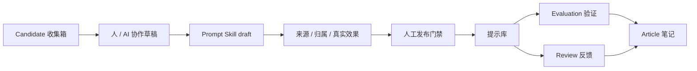

# 空心树洞（LogWood）

> **可验证的提示词仓库**

空心树洞是一个 **可执行、可比较、可审计的增强版提示词仓库**：把 Prompt 正文、真实效果、来源、AI 归属、验证记录和长期笔记放在同一条链上。AI 负责协作整理草稿，人负责审核与公开。

## 提示词生命线

项目围绕同一个灵感或资源建立生命周期和表达沉淀两条互相关联的轨道。


```mermaid
flowchart LR
  C[Candidate 收集箱] --> D[人 / AI 协作草稿]
  D --> P[Prompt Skill draft]
  P --> G[来源 / 归属 / 真实效果]
  G --> H[人工发布门禁]
  H --> L[提示库]
  L --> E[Evaluation 验证]
  L --> R[Review 反馈]
  E --> N[Article 笔记]
  R --> N
```

### Prompt 进化线

```text
灵感或资源
  → 收集箱
  → 提示词草稿
  → 人工发布
  → 真实效果与同类对比
  → 持续验证、改进或归档
```

### 证据沉淀线

```text
真实效果 / 自由反馈
  → 实验记录与失败样本
  → Evaluation v2
  → 比较、复盘与长期笔记
```

两条线共享同一个 Prompt 和来源链。公开结果不抹掉中间试错，沿途证据也能反过来推动 Prompt 继续改进。

完整产品定义见 [`docs/PRODUCT_POSITIONING.md`](./docs/PRODUCT_POSITIONING.md)。正式评测规范见 [`docs/EVALUATION_PROTOCOL_V2.md`](./docs/EVALUATION_PROTOCOL_V2.md)。整体升级计划见 [Issue #15](../../issues/15)。

## 产品结构

公开核心入口：

| 入口 | 路由 | 作用 |
|---|---|---|
| 提示库 | `/skills` | 只浏览已公开 Prompt Skill，查看正文、真实效果与证据 |
| 提示词对比 | `/compare/prompts` | 选择 2–3 条，逐行比较效果、正文、来源、归属和验证 |
| 验证记录 | `/evaluations` | 查看基于版本、环境、任务、证据、复现性和失败边界的 Evaluation v2 |
| 笔记 | `/articles` | 沉淀实验、比较、项目复盘和长期判断 |
| 关于 | `/about` | “秦”“造器，筑界，观心。”与人与 AI 共生创作原则 |

作者工作台与历史兼容：

- 收集箱：`/candidates`
- AI 整理台：`/forge`
- 归档：`/scraps`
- 历史工具/视觉/对比：`/tools`、`/app`、`/compare`
- 历史 Prompt：`/prompt/[slug]`

AI 整理台默认创建提示词草稿，也可选择笔记草稿或确定性本地模板；同一请求可幂等重试。所有模式都只写入草稿，不替代真实测试，也不生成或伪造证据。Article 只有人工批准当前版本后才能发布，内容修改会自动使旧批准失效。

## Review 与 Evaluation

项目同时保留两种内容层：

### Review：自由记录

- 第一感受
- 吐槽和踩坑
- 提问、求证和替代方案
- 阶段性使用经验
- 可匿名或登录参与

### Evaluation v2：正式评测

- 明确被测对象和版本
- 记录模型、软件、操作系统和硬件环境
- 保存测试任务、输入、执行过程和输出
- 支持外部证据、复现级别和重复次数
- 按 Skill、模型、软件/服务、普通资源使用不同评分协议
- 记录成功点、限制、失败边界和总体结论
- 草稿允许逐步补齐；发布态必须通过协议门禁

历史 Review 不会被静默转换成正式 Evaluation。首期 Evaluation 写入仅管理员开放，公开用户可以浏览已发布报告。

## 当前实现

- 灵感池：`/candidates` 和 `/candidates/manage`
- 提示库：`/skills` 只展示已公开 Skill；Target.prompt 在折叠兼容区保留
- 提示词对比：`/compare/prompts`
- 废品站：`/scraps` 展示 `Candidate.dropped`
- 正式评测：`/evaluations`、`/evaluations/[id]`、`/evaluations/manage`
- 吐槽室：`/talk`
- 历史资源：`/tools` 及 Editor / Coding / Model / Prompt 旧详情路由
- 视觉收藏详情和管理：`/app/[slug]`、`/app/manage`
- 笔记：`/articles`
- AI / 本地协作草稿：`/forge`
- 作者叙事：`/about`
- 视觉来源与权利：VisualAsset 保存 hash/来源/权利状态，未确认权利的 App 不能发布
- Agent MCP：`/api/mcp`，支持灵感整理、内容发布和多 Agent 回复协调
- Review：多态关联 Target、Skill、App 或 Candidate
- Evaluation：独立模型和协议版本，不修改历史 Review
- 社区互动：匿名或登录发布、评论、点赞、举报
- 内容治理：限流、敏感内容判定、自动隐藏和审核流
- 工程底座：模块化单体、PostgreSQL、Prisma、NextAuth、Docker Compose

MCP 的鉴权、工具参数、AI 来源字段和 Agent 配置方式见 [`docs/MCP.md`](./docs/MCP.md)；
低 Token 回复队列、Totemora 路由和部署方式见
[`docs/agent-reply-coordinator.md`](./docs/agent-reply-coordinator.md)。

## 核心原则

1. **同一对象持续生长**：状态变化不创建断裂的新对象。
2. **证据优于声量**：热度用于发现，证据决定可信度。
3. **自由记录与正式评测分层**：真实情绪可以低门槛记录，正式结论必须有上下文和证据。
4. **过程和结果同等重要**：失败、吐槽和判断变化必须可追溯。
5. **废品不是删除**：淘汰结论保留来源和证据，并允许重新进入观察池。
5. **复用优于收藏**：内容最终应帮助用户快速开始或避免重复踩坑。
6. **兼容优于重写**：历史数据先挂接、再迁移，不为模型整洁牺牲内容资产。
7. **AI 辅助而不代替**：未经验证的内容不能被包装成事实。
8. **版本和时效可见**：模型、软件、Skill 和评测结论都可能过期。

## 文档索引

| 文档 | 责任 |
|---|---|
| [`DESIGN.md`](./DESIGN.md) | Impeccable 设计系统、双 surface 规则、响应式与无障碍契约 |
| [`docs/PRODUCT_POSITIONING.md`](./docs/PRODUCT_POSITIONING.md) | 产品定位、双线生命线、内容对象、迁移原则和衡量方式；产品定义 SSOT |
| [`docs/EVALUATION_PROTOCOL_V2.md`](./docs/EVALUATION_PROTOCOL_V2.md) | 正式评测协议、维度、字段、发布门禁和权限 |
| [`docs/PROJECT_PLAN.md`](./docs/PROJECT_PLAN.md) | 当前实现、架构边界、风险、近期变更和执行计划 |
| [`docs/UNIFIED_SITE_MIGRATION.md`](./docs/UNIFIED_SITE_MIGRATION.md) | 三源审计、兼容边界、视觉资产导入和数据库发布步骤 |
| [`docs/UNIFIED_ROADMAP.md`](./docs/UNIFIED_ROADMAP.md) | 已完成阶段和后续上线/证据/运营排期 |
| [`docs/RELEASE_ACCEPTANCE_MATRIX.md`](./docs/RELEASE_ACCEPTANCE_MATRIX.md) | 自动化、UI、数据迁移和发布授权验收矩阵 |
| [`SPEC.md`](./SPEC.md) | 历史 Review MVP 规格；不再定义当前产品定位 |
| [`docs/SEO_STRATEGY.md`](./docs/SEO_STRATEGY.md) | SEO 长期策略和变更约束 |
| [`docs/SEO_CHANGELOG.md`](./docs/SEO_CHANGELOG.md) | 近期 SEO 增量决策 |
| [`docs/STYLE_GUIDE.md`](./docs/STYLE_GUIDE.md) | 视觉系统与组件样式规范 |
| [`docs/modules/`](./docs/modules/) | 各业务模块契约与测试清单 |

## 技术栈

- Frontend：Next.js 14 App Router、React 18、TypeScript、Tailwind CSS
- Backend：Next.js Route Handlers、Service Layer
- Database：PostgreSQL、Prisma ORM
- Auth：NextAuth.js（GitHub OAuth + 管理员凭证）
- Editor：Tiptap
- Test：Vitest
- Deploy：Docker Compose；保留 Vercel 运行能力

## 快速启动

### 1. 准备环境变量

```bash
cp .env.example .env
```

生产环境至少需要：

- `DATABASE_URL`
- `NEXTAUTH_URL`
- `NEXTAUTH_SECRET`

GitHub 登录和管理员变量见 `.env.example`。

### 2. 启动服务

```bash
docker compose up --build
```

本地热更新：

```bash
NODE_ENV=development docker compose up --build
```

### 3. 数据库 schema 更新

Compose 会先运行一次性 `schema-sync`，再由 `db-bootstrap` 创建或刷新非超级用户
应用角色；Web 和回复 Worker 只有在两步都成功后才启动。`.env` 中必须提供两个不同、
至少 32 位且仅包含字母数字的随机密码：

```bash
openssl rand -hex 32
docker compose up -d --build
```

数据库管理员凭据只用于 schema 同步，Web 和 Worker 使用 `POSTGRES_APP_USER`。
PostgreSQL 为 host-network Worker 保留回环端口，但不再使用仓库默认口令。正式生产
数据库应先备份并审阅 schema diff；长期建议切换到版本化 Prisma migration。

从旧版固定数据库口令升级且保留 `./data/postgres` 时，不能只修改 `.env`。先保持旧
PostgreSQL 容器运行，备份数据，再把两个新密码导出到当前 shell 并执行一次性升级：

```bash
export POSTGRES_ADMIN_PASSWORD="$(openssl rand -hex 32)"
export POSTGRES_APP_PASSWORD="$(openssl rand -hex 32)"
./scripts/upgrade-db-credentials.sh
docker compose up -d --build
```

该脚本通过现有容器的本地 Unix socket 轮换管理员口令、创建非超级用户并补齐权限，
不会重建数据目录。随后 `schema-sync` 和 `db-bootstrap` 会再次验证新凭据。

若新栈启动失败且必须恢复旧版，保持数据库容器和数据目录不动。旧版管理员口令可能
不满足新强度要求，因此只能对这次本地 socket 回滚显式开启兼容开关：

```bash
export LOGWOOD_ALLOW_LEGACY_DB_ROLLBACK=1
export POSTGRES_ADMIN_PASSWORD="<升级前的管理员口令>"
./scripts/upgrade-db-credentials.sh
unset LOGWOOD_ALLOW_LEGACY_DB_ROLLBACK
```

确认脚本成功后再恢复旧版代码和 Compose。该开关不会传入 `schema-sync` 或
`db-bootstrap`，正常启动仍会拒绝弱口令；不要删除 `./data/postgres`。

启用 AI 内容回复 Worker：

```bash
docker compose --profile agent-reply up -d --build reply-worker
```

Worker 的 Totemora 连接、Secret 和空队列成本说明见
[`docs/agent-reply-coordinator.md`](./docs/agent-reply-coordinator.md)。

### 4. 验证

```bash
docker compose exec web bun run test
docker compose exec web bunx tsc --noEmit
docker compose exec web bun run build
```

## 架构

主要模块位于 `src/modules/`：

- `skill`：Skill CRUD、分类、效果图和草稿状态
- `candidate`：灵感 / 候选和现有晋升流程
- `target`：历史模型、软件、工具和 Prompt 目录
- `review`：自由记录的多态发布、查询和统计
- `evaluation`：正式评测协议、发布门禁、查询和持久化
- `comment` / `like`：Review 互动
- `moderation` / `rate-limit`：治理、举报和行为限流
- `identity`：登录和匿名身份
- `article` / `article-column`：洞笔记和专栏
- `app`：案例、应用和项目
- `forge`：DeepSeek / 本地幂等草稿整理与恢复性错误
- `prompt-runner`：DeepSeek 文本与 CPA 生图能力路由、服务器白名单和非持久化测试结果
- `audit`：管理员状态变更审计

Route Handler 调用模块 service；跨模块通过公开契约协作，避免直接访问其他模块的 Prisma 模型。

## 数据兼容约束

- 不删除历史内容
- 不改变历史 Review ID
- 保留旧 slug 和可访问路径
- Candidate 进入下一阶段后，Review、Comment、Like 和 Evaluation 必须仍然可追溯
- 历史自由记录继续按旧 schema 展示
- Evaluation 使用独立表和版本化协议
- 新模型稳定后再通过 redirect、canonical 和迁移脚本收口
- 数据迁移支持 dry-run、统计核对、重复执行和回滚

## 测试策略

优先级：

1. Service 业务规则：校验、鉴权、限流、状态机、评测协议和数据迁移
2. API 集成测试：参数、错误码、鉴权和数据库写入
3. 少量核心 E2E：围绕完整用户生命线

Evaluation 变更至少覆盖：

- 对象与协议匹配
- 草稿允许部分字段
- 发布需要全部维度评分
- 输出或证据门禁
- 复现级别和重复次数
- 公开查询排除草稿与归档
- sitemap 只输出已发布详情

## 贡献方式

Issue #15 继续跟踪：

- Candidate 晋升后的历史连续性
- Resource / Skill 成熟度和版本模型
- Quick Take 持久化类型
- Skill 输入输出、依赖、Quick Start 和技能包
- 历史数据 dry-run 迁移
- 真实 AI 辅助评测和证据整理

功能、架构、数据库或迁移策略变化时，必须同步更新 `docs/PROJECT_PLAN.md`。

## License

待定。
